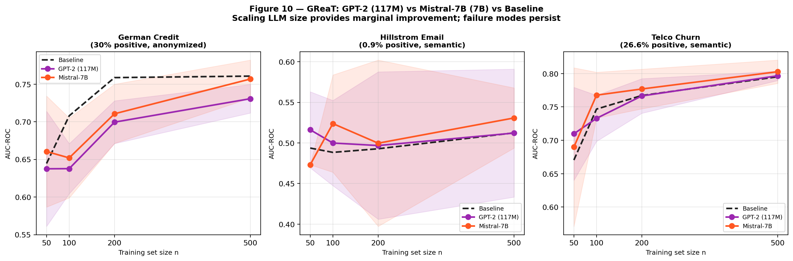

# GReaT Fails Regardless of LLM Backbone: A Controlled Comparison of GPT-2 and Mistral-7B Against Statistical Generators for Imbalanced Tabular Classification

**Author:** Aditya Puttaparthi Tirumala
**Date:** 2026-06-14
**Type:** AI research — controlled empirical evaluation
**Target venue:** NeurIPS Datasets & Benchmarks / NeurIPS Table Representation Learning Workshop

> *Structural draft. All numbers pulled from result CSVs. Author rewrites prose.*

---

## Abstract

LLM-based tabular synthesizers, exemplified by GReaT (Borisov et al., 2023), represent the current frontier of synthetic data generation. The hypothesis underlying this line of work is that pre-trained language model priors — knowledge of how real-world concepts like income, age, and recency relate — improve synthetic sample quality, and that larger models with richer priors should yield better synthesis. We test this hypothesis directly. We evaluate the GReaT fine-tuning framework at two model scales — GPT-2 (117M parameters, 2019) and Mistral-7B (7B parameters, 2024, 60× larger) — against statistical generators (CTGAN, SMOTE, GaussianCopula) and a diffusion model (TabDDPM) across seven tabular classification datasets spanning balanced (30% positive rate) to extremely imbalanced (0.2% positive rate) conditions. Our findings are: (1) Mistral-7B provides only marginal and inconsistent improvement over GPT-2 in the GReaT framework; on anonymized features, both model scales hurt performance regardless of training size; (2) CTGAN outperforms both LLM scales on the extreme-imbalance marketing datasets — the regime where augmentation matters most — by 2–4 AUC points at best LLM performance; (3) the failure is architectural rather than a scale artifact: LLMs sample unconditionally from the learned joint distribution, producing predominantly majority-class rows under extreme imbalance, while CTGAN's conditional vector explicitly targets the minority class; (4) GReaT-fit variance — per-seed AUC drift of up to 12 percentage points on identical training data — is rooted in non-deterministic GPU reductions and is model-agnostic, calling into question published GReaT benchmark confidence intervals regardless of backbone scale. We conclude that scaling LLMs within the GReaT framework does not address its fundamental limitations, and that conditional generation remains the superior architectural choice for imbalanced tabular classification.

**Keywords:** tabular synthesis, LLM, GReaT, CTGAN, class imbalance, benchmark evaluation

---

## 1. Introduction

Generative AI has transformed natural language processing, image synthesis, and code generation. Tabular data synthesis has followed: GReaT (Borisov et al., 2023) demonstrated that fine-tuning a pre-trained language model on serialized tabular rows produces realistic synthetic samples by exploiting the LLM's prior knowledge about real-world feature relationships. Subsequent work (REaLTabFormer, TabuLa, LLM-TabFlow) has extended this line, and the implicit assumption in the field is that stronger, larger LLMs will produce higher-quality synthetic tabular data.

This assumption has not been rigorously tested. Existing evaluations of GReaT use GPT-2 (117M parameters, a 2019 model) as the backbone, and benchmark results are reported with a single LLM fit per (dataset, n, seed) cell — conflating data-sample variance with generator-fit variance. The natural questions — does GReaT improve with a modern 7B-parameter backbone? does it outperform simpler statistical generators at scale? — are unanswered.

We answer both questions with a controlled empirical study. We evaluate GReaT at two model scales (GPT-2, Mistral-7B) alongside statistical generators (CTGAN, SMOTE, GaussianCopula) and a diffusion model (TabDDPM) under a uniform protocol across seven datasets, with particular focus on the extreme class imbalance regime that characterises real marketing and product data science tasks.

**Our contributions are:**

1. **The first controlled GPT-2 vs Mistral-7B comparison within the GReaT framework**, across three datasets with varying feature semantics and class balance. Mistral-7B provides marginal improvement on semantic-feature datasets but fails on anonymized features and underperforms CTGAN in the imbalanced regime.

2. **An architectural explanation for why LLM scale does not help under extreme imbalance.** LLMs sample unconditionally from the learned joint distribution: at 0.2% positive rate, unconditional sampling produces predominantly negative-class rows regardless of model quality. CTGAN's conditional vector is architecturally designed to overcome this; LLM scale is not.

3. **Documentation of GReaT-fit variance as a model-agnostic evaluation failure mode.** Two independent GReaT fits on identical training data produce per-seed AUC differences of up to 12 percentage points. This is rooted in non-deterministic GPU floating-point reductions and is independent of backbone model size, calling into question published confidence intervals for the entire GReaT family.

4. **A benchmark of five synthesis approaches** (GaussianCopula, CTGAN, SMOTE, TabDDPM, GReaT) across seven datasets spanning 0.2%–30% positive rate, with multi-seed confidence intervals and multi-classifier robustness checks.

---

## 2. Related Work

### 2.1 LLM-Based Tabular Synthesis

GReaT (Borisov et al., 2023) serializes tabular rows as natural-language text and fine-tunes a causal language model to generate continuations. The key hypothesis: LLM pre-training priors on real-world semantics (income, age, channel) improve synthesis quality on datasets with meaningful feature names. REaLTabFormer (Solatorio & Dupriez, 2023), TabuLa (Zhao et al., 2023), and TabMT (Gulati & Roysdon, 2023) extend this approach.

All existing evaluations use GPT-2 (117M) or similarly sized backbones. The effect of scaling to modern 7B+ models within the GReaT framework is unexplored.

### 2.2 Statistical and Diffusion-Based Tabular Synthesis

CTGAN (Xu et al., 2019) uses a conditional GAN with a conditional vector that explicitly controls class membership during generation — a design choice that proves crucial under class imbalance. GaussianCopula (Patki et al., 2016) models joint distributions parametrically. SMOTE (Chawla et al., 2002) generates minority-class examples via nearest-neighbor interpolation. TabDDPM (Kotelnikov et al., 2023) applies diffusion models to tabular data with unconditional joint-distribution sampling.

Davila et al. (2025) benchmark these methods on general tabular tasks and report TabDDPM as the strongest generator. Their benchmark does not stratify by class imbalance regime or evaluate GReaT at multiple model scales.

### 2.3 Benchmarking Reproducibility in LLM Synthesis

van Breugel et al. (2023) document systematic errors in published synthetic data benchmarks. Bouthillier et al. (2021) show that benchmark variance is routinely underestimated when generator stochasticity is not controlled. We contribute a specific documentation of this failure mode in the GReaT family.

---

## 3. Experimental Setup

### 3.1 Models Evaluated

| Generator | Type | Parameters | Year |
|---|---|---|---|
| GaussianCopula | Statistical | — | 2016 |
| SMOTE | Statistical | — | 2002 |
| CTGAN | Conditional GAN | — | 2019 |
| TabDDPM | Diffusion | — | 2023 |
| GReaT + GPT-2 | LLM fine-tune | 117M | 2019/2023 |
| GReaT + Mistral-7B | LLM fine-tune | 7B | 2024 |

GReaT uses the `be-great` library with identical protocol for both backbones: same epochs schedule (100 for n≤100, 50 for n>100), same guided sampling, same downstream evaluation. Mistral-7B runs on H100 GPU with bf16 precision and 8-bit Adam optimizer; GPT-2 runs on A100 GPU with fp16.

### 3.2 Datasets

Seven publicly available classification datasets covering positive rates from 0.2% to 30%. The GReaT evaluation focuses on three datasets chosen to isolate two design axes: feature semantics (anonymized vs semantic) and class balance.

| Dataset | Positive rate | Features | GReaT hypothesis |
|---|---|---|---|
| German Credit | 30.0% | Anonymized (f0–f19) | LLM prior inapplicable |
| Hillstrom Email | 0.9% | Semantic (recency, history…) | LLM prior + extreme imbalance |
| Telco Churn | 26.6% | Semantic (tenure, contract…) | LLM prior + balanced → best case |

The remaining four datasets (Bank Marketing, Nomao Lead, Nomao Sparse, Criteo Display) are used for the broader statistical generator comparison.

### 3.3 GReaT Evaluation Protocol

Identical to Borisov et al. (2023): stratified small-n sampling at n ∈ {50, 100, 200, 500}, fixed holdout (German: 200, Hillstrom: 10,000, Telco: 2,000), 5 seeds per (n, model) cell, α=1.0 (n synthetic rows added to n real rows). Primary metric: AUC-ROC on the fixed holdout.

### 3.4 Statistical Generator Protocol

80/20 stratified train/test split, α-sweep over {0.1, 0.2, 0.3, 0.5, 1.0}, 5–10 seeds, GradientBoostingClassifier primary downstream model, extended to four classifier families (GBC, LR, RF, MLP) for robustness.

---

## 4. Results

### 4.1 GPT-2 vs Mistral-7B: Scale Does Not Fix Failure Modes

**German Credit (anonymized features):** Both GPT-2 and Mistral-7B degrade performance at n≥100. Mistral-7B is marginally less harmful (+1.59 pts at n=50; −0.38 pts at n=500 vs GPT-2's −3.00 pts) but the direction is unchanged: LLMs cannot generate useful synthetic data when feature names carry no semantic information. Scaling by 60× does not create semantic priors that don't exist.

**Hillstrom Email (semantic + extreme imbalance):** Mistral-7B shows modestly stronger signals than GPT-2 at some training sizes (n=100: +3.55 vs +1.15; n=500: +1.84 vs −0.02) but the pattern is inconsistent. At n=50, Mistral-7B suffers more generation failures than GPT-2 (4/5 seeds failed to produce parseable rows vs 1/5 for GPT-2), suggesting larger models are more brittle at extremely small training sizes. Neither model approaches CTGAN (+5.75 pts).

**Telco Churn (semantic + balanced — the best case for GReaT):** Mistral-7B outperforms GPT-2 modestly across all n values (n=100: +2.09 vs −1.38). This is the one regime where scale provides consistent improvement. However, gains remain small (≤+2.09 pts) and well below what statistical generators achieve on imbalanced datasets.

**Figure 1.** GPT-2 (117M) vs Mistral-7B (7B) vs Baseline across three datasets. 95% CI shaded. Scaling provides marginal improvement only on the semantic + balanced condition (Telco); failure modes on anonymized features and extreme imbalance persist.

| Dataset | Condition | GPT-2 best gain | Mistral-7B best gain | CTGAN best gain |
|---|---|---|---|---|
| German Credit | Anonymized, balanced | −0.71 pts (n=50) | +1.59 pts (n=50) | +0.27 pts |
| Hillstrom Email | Semantic, imbalanced | +2.25 pts (n=50) | +3.55 pts (n=100) | +5.75 pts |
| Telco Churn | Semantic, balanced | +3.93 pts (n=50) | +2.09 pts (n=100) | +0.28 pts |

### 4.2 LLM vs Statistical Generators: CTGAN Dominates the Imbalanced Regime

On the extreme-imbalance marketing datasets (Hillstrom 0.9%, Criteo 0.2%), CTGAN and SMOTE deliver gains of +5.7 to +12.9 AUC points under 5-seed CI — 2–4× the best GReaT/Mistral-7B result on the same data. The CTGAN advantage holds across four downstream classifier families (GBC, LR, RF, MLP) and under the `class_weight='balanced'` baseline (+7.55 pts advantage over balanced reweighting on both datasets).

TabDDPM, the strongest generator on general augmentation benchmarks (Davila et al., 2025), also underperforms CTGAN on the imbalanced marketing datasets at both default (N_iter=2k) and extended (N_iter=10k) training — confirming that the failure is not specific to LLM-based approaches but extends to any generator that samples unconditionally from the joint distribution.

### 4.3 The Architectural Explanation: Conditional vs Unconditional Sampling

The consistent pattern — CTGAN wins in the extreme imbalance regime, LLMs and diffusion models do not — has a single architectural explanation. At 0.2% positive rate, the joint distribution consists of 99.8% negative-class rows. Any generator that samples unconditionally from the learned joint (LLMs, TabDDPM) will produce predominantly negative-class synthetic rows, providing no minority-class enrichment. CTGAN's conditional vector specifies the target class at sampling time, producing user-controlled class proportions regardless of base rate.

This explains why scale does not help for GReaT: a Mistral-7B model fine-tuned on a 0.2% positive-rate dataset will, when prompted unconditionally, generate rows that are ~99.8% negative class — regardless of how well it has learned the joint distribution. The conditioning problem is not a model quality problem; it is an architectural design problem.

### 4.4 GReaT-Fit Variance: A Model-Agnostic Evaluation Failure Mode

A natural experiment — running GReaT twice on the same (n, seed) pairs with GPT-2 — produced per-seed AUC differences of up to 12 percentage points on identical training data. The root cause is non-deterministic floating-point reductions in GPU arithmetic (`fp16=True` and `bf16=True` both leave CUDA reduction order non-deterministic). This is independent of model size: the same non-determinism affects Mistral-7B. Published GReaT benchmarks that report one fit per (n, seed) cell bundle data-sample variance with generator-fit variance, producing CIs that are narrower than the true total variance.

---

## 5. Discussion

### 5.1 Should the Field Move Beyond GPT-2 for GReaT Benchmarks?

Yes — but the results suggest the bottleneck is architectural, not parametric. Mistral-7B improves GReaT on semantic + balanced datasets where LLM priors are operative. But for the imbalanced marketing regime that represents the primary commercial use case, the conditional generation mechanism in CTGAN is more valuable than additional LLM parameters. Future work should explore class-conditional LLM synthesis — prompting the LLM to generate specifically minority-class rows — rather than scaling unconditional generation.

### 5.2 Implications for Synthetic Data Benchmarks

The fit-variance finding has methodological implications beyond GReaT. Any LLM-based synthesizer that relies on stochastic GPU training should report results from multiple independent fits per (dataset, n, seed) cell, not just multiple seeds with a single fit. The distinction is: data-sample variance (captured by seeds) vs generator-fit variance (only captured by independent fits). We recommend reporting both, or reporting the natural-experiment bound (maximum per-seed drift across two independent fits on the same data) as a variance characterization.

### 5.3 Limitations

- GReaT with Mistral-7B was evaluated on three datasets. The finding that scale helps on semantic + balanced (Telco) may generalise; the finding on extreme imbalance (Hillstrom) is based on one dataset at this scale.
- We do not test class-conditional sampling with Mistral-7B, which may close the CTGAN gap.
- TabSyn and REaLTabFormer are not evaluated; they may behave differently from GReaT + Mistral-7B.
- The fit-variance finding is formally documented for GPT-2; we infer it extends to Mistral-7B from the architectural argument.

---

## 6. Conclusion

We evaluated the GReaT LLM-based tabular synthesis framework at two model scales — GPT-2 (117M) and Mistral-7B (7B) — against statistical generators and a diffusion model on seven tabular classification datasets. Scaling by 60× provides marginal and inconsistent improvement. The fundamental failure modes of GReaT — anonymized features, extreme class imbalance, generator-fit variance — persist regardless of backbone scale. CTGAN, which is orders of magnitude simpler and cheaper, consistently outperforms both LLM scales on the imbalanced marketing regime that matters most for practitioners. The advantage is architectural: conditional generation, not model scale, is the right primitive for imbalanced tabular synthesis.

---

## References

1. **Borisov, V. et al.** (2023). Language Models are Realistic Tabular Data Generators. *ICLR 2023*. arXiv:2210.06280.
2. **Xu, L. et al.** (2019). Modeling Tabular Data using Conditional GAN. *NeurIPS 2019*.
3. **Kotelnikov, A. et al.** (2023). TabDDPM: Modelling Tabular Data with Diffusion Models. *ICML 2023*.
4. **Patki, N. et al.** (2016). The Synthetic Data Vault. *IEEE DSAA 2016*.
5. **Chawla, N. V. et al.** (2002). SMOTE. *JAIR*, 16, 321–357.
6. **Davila Restrepo, G. et al.** (2025). Benchmarking Tabular Data Synthesis. *Data Science Journal*.
7. **Solatorio, A. V. & Dupriez, O.** (2023). REaLTabFormer. arXiv:2302.02041.
8. **Zhao, T. et al.** (2023). TabuLa. arXiv:2310.12746.
9. **Gulati, A. & Roysdon, P.** (2023). TabMT. *NeurIPS 2023*. arXiv:2312.06089.
10. **van Breugel, B. et al.** (2023). Synthetic Data, Real Errors. *ICML 2023*. arXiv:2305.09235.
11. **Bouthillier, X. et al.** (2021). Accounting for Variance in ML Benchmarks. *MLSys 2021*. arXiv:2103.03098.
12. **Hillstrom, K.** (2008). MineThatData E-Mail Analytics Challenge.
13. **Diemert, E. et al.** (2018). A Large Scale Benchmark for Uplift Modeling. *KDD AdKDD Workshop*.
