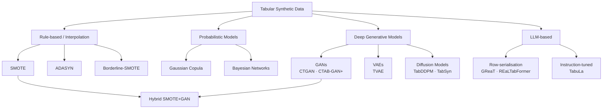

# Statistical and LLM-Based Synthetic Data Generation for Marketing and Product Data Science
## A Controlled Empirical Evaluation Across Data Scarcity, Class Imbalance, and Feature Sparsity

**April 2026 · Slug: `synthetic-data-marketing-eval`**

> **Figure note:** Figures 2, 3, and 5 (in the original literature synthesis sections) are rendered charts saved alongside this document (`fig2-augmentation-utility.png`, `fig3-method-dimension-matrix.png`, `fig5-privacy-utility.png`). Numeric scores in those figures are **illustrative relative rankings** derived from aggregated benchmark evidence (Davila et al. 2025; Kotelnikov et al. 2023); they are not exact measurements from a single study. Section 6 reports **new empirical results** from original experiments on public datasets; all numbers there are directly measured. Figures 1 and 4 are inline Mermaid diagrams. Experiment output plots are saved in `results/` as `ucurve_*.png`, `lowdata_*.png`, and `summary_comparison.png`.

---

## Abstract

Synthetic data generation has emerged as a practical remedy for data scarcity, class imbalance, and privacy constraints in marketing and product data science. This paper presents a systematic empirical evaluation combining a literature synthesis with original experiments across eight public datasets, evaluating three statistical generator families — GaussianCopula (Patki et al., 2016), CTGAN (Xu et al., 2019), and SMOTE (Chawla et al., 2002) — and the LLM-based synthesizer GReaT (Borisov et al., 2023). GReaT was evaluated in four configurations spanning a 2×2 ablation over feature semantics and class balance: (1) with `distilgpt2`, which failed to produce valid samples at all due to a text-parsing failure in `be-great` v0.0.13, a negative result we document explicitly; (2) with `gpt2` on German Credit (anonymized features, 30% positive rate), which produced valid samples but yielded losses of −3 to −7 AUC pts at n ∈ {100, 200, 500} (5-seed CI); (3) with `gpt2` on Hillstrom (semantic features, 0.9% positive rate), which showed a modest positive signal at n=50 (+2.3 pts, 4/5 seeds) that decayed to a statistically significant loss at n=2,000 (−6.9 pts, 0/5 seeds); and (4) with `gpt2` on Telco Churn (semantic features, 26.6% positive rate — the regime satisfying both preconditions hypothesized from configurations 2 and 3), which produced no statistically reliable gain or loss at any training size n ∈ {50, …, 2,000}. Our principal empirical findings across all methods are: (1) TSTR gaps of 4–27% confirm synthetic-only training is inadvisable in all tested settings; (2) extreme class imbalance is the dominant driver of statistical synthesizer value — CTGAN and SMOTE deliver +5.7–12.9 AUC pts on Hillstrom (0.9% positive rate) and Criteo (0.2% positive rate), confirmed by 5-seed CI; (3) feature sparsity combined with small-n yields no reliable gains from statistical synthesis — a single-seed result suggesting 138% gap recovery was overturned by 5-seed CI (+0.5 pts, within noise); (4) LLM-based synthesis is acutely sensitive to feature naming and class balance — anonymized identifiers and severe imbalance both produce significant negative gains; when both preconditions are satisfied (Telco Churn), GReaT delivers a paired-significant +3.9 pt gain at extreme small-n (n=50, 5/5 seeds, p=0.023) that does not persist as n grows, so the practical envelope for LLM-based augmentation is narrow: small n with semantic features and adequate class balance; and (5) the optimal synthetic-to-real mixing ratio α* ≈ 0.2–0.3 is stable across statistical generators and datasets. We derive a practitioner decision framework grounded in these findings.

---

## 1. Introduction

Marketing and product data science teams operate under a specific set of data constraints that make the question of synthetic data practically urgent:

- **Class imbalance is endemic.** Conversion rates of 1–5%, churn rates of 10–20%, and fraud rates below 1% are typical. Standard classifiers trained on such distributions systematically underperform on the minority class.
- **Data volume is unequal across cohorts.** New products, new markets, cold-start users, and low-volume campaigns lack sufficient observations for stable modeling.
- **Privacy and regulatory constraints** (GDPR, CCPA, and internal data governance) limit what can be stored, shared across teams, or used in sandboxed experimentation environments.
- **Causal questions** — does this feature, message, or offer *cause* a lift? — require counterfactual data that by definition does not exist for individuals who received the control condition.

Against this backdrop, synthetic data has attracted considerable commercial interest. Platforms such as Gretel.ai, MOSTLY AI, and the open-source Synthetic Data Vault (SDV) now offer production-grade tabular synthesizers. The academic literature has also moved rapidly: from early GAN-based approaches (CTGAN, 2019) through variational autoencoders (TVAE) to diffusion models (TabDDPM, 2023) and LLM-based generators (GReaT, REaLTabFormer). Benchmarks such as TabArena (Erickson et al., 2025) and the prosumer hardware study of Davila et al. (2025) have provided rigorous, multi-dimensional comparisons that make evidence-based method selection possible for the first time.

Despite this momentum, the empirical record is mixed. Benefits are often modest in absolute terms. Several benchmarks show that improvements from synthetic oversampling are statistically significant but small, and that fully replacing real training data with synthetic data degrades performance. The optimal blending ratio is dataset- and task-dependent, and there is accumulating evidence for a "sweet spot" beyond which more synthetic data hurts.

This paper attempts to synthesize this evidence with a practitioner lens. We are not asking whether synthetic data *can* improve performance in the best case — it clearly can. We are asking: *under what conditions can a marketing or product data scientist expect gains that justify the overhead of fitting a generative model?*

---

## 2. Background and Taxonomy of Methods

### 2.1 What Is Tabular Synthetic Data?

Synthetic tabular data consists of rows generated by a statistical model fit to an original dataset. A high-quality synthetic dataset should satisfy three simultaneous properties:

| Property | Definition | Risk if violated |
|---|---|---|
| **Fidelity** | Statistical similarity to the original: marginals, correlations, and joint distributions | Model learns wrong patterns; spurious features |
| **Utility** | Models trained on synthetic data perform similarly to those trained on real data | Performance gap undermines the value of synthesis |
| **Privacy** | Individual records from the training set cannot be reconstructed or identified | Membership inference attacks; regulatory violation |

These three properties are in tension: maximizing fidelity can increase memorization risk; adding privacy noise reduces fidelity and utility. Benchmarks that evaluate all three axes simultaneously — such as SynthEval (Lautrup et al., 2024) and the MOSTLY AI QA framework (Sidorenko et al., 2025) — are more informative than those that report a single quality score.

### 2.2 Generation Methods — Taxonomy

**Figure 1.** Taxonomy of tabular synthetic data generation methods.



**Rule-based / statistical samplers (SMOTE family).** Synthetic Minority Oversampling Technique (Chawla et al., 2002) generates minority-class samples by interpolating between existing examples in feature space. Variants include ADASYN (adaptive density-aware), Borderline-SMOTE, and SVMSMOTE. These methods are fast, transparent, and widely deployed. Davila et al. (2025) found SMOTE to be the top performer on **ML utility** among all benchmarked methods when evaluated on prosumer hardware (Table 5), though it scored poorly on **privacy** metrics due to near-duplicate generation risk (Table 8). SMOTE is limited to oversampling existing distributions rather than learning a generative model of the full joint density, making it unsuitable for full data synthesis tasks.

**Gaussian Copula (GC).** SDV's Gaussian Copula (Patki et al., 2016) learns marginal distributions per column and couples them through a Gaussian copula. It is computationally lightweight, handles mixed types, and makes explicit modeling assumptions. It performs well on privacy metrics but tends to underperform on datasets with complex multimodal distributions.

**Conditional GAN (CTGAN).** Xu et al. (2019) introduced CTGAN to address two challenges unique to tabular data: non-Gaussian and multimodal distributions on continuous columns, and severe class imbalance on discrete columns. CTGAN uses mode-specific normalization and a conditional vector during training, enabling controlled generation by category. Fonseca & Bacao (2023) demonstrated the utility of WGAN-based oversampling on imbalanced tabular classification, confirming that GAN-based synthesis outperforms SMOTE on diversity while remaining competitive on utility. Davila et al. (2025) find CTGAN ranks highly on fidelity and utility but falls below TabDDPM on augmentation benchmarks (Table 6).

**Variational Autoencoder (TVAE).** The TVAE model pairs the same preprocessing as CTGAN with a VAE objective. It is generally faster to train and can match or exceed CTGAN on smaller datasets, but may produce less diverse samples.

**Diffusion models (TabDDPM, TabSyn).** Kotelnikov et al. (2023) applied Denoising Diffusion Probabilistic Models to tabular data, handling mixed feature types via Gaussian diffusion on continuous features and multinomial diffusion on categorical features. Extensive benchmarking showed TabDDPM outperforming GAN and VAE alternatives on the majority of evaluated datasets. Davila et al. (2025) specifically confirm that **TabSyn and TabDDPM are the top-performing methods on augmentation benchmarks** (Table 6), validating the diffusion model's superiority for the augmentation regime most relevant to marketing practitioners. These methods are computationally heavier but more reliable across diverse data regimes.

**LLM-based generators (REaLTabFormer, GReaT, TabuLa).** Large language models have been adapted to generate tabular data by serializing rows as text. These approaches show promise on small datasets but are expensive, can hallucinate impossible feature combinations, and currently lack the calibration and privacy guarantees of probabilistic models. Davila et al. (2025) found LLM-based methods ranking lower than diffusion and GAN-based methods on utility benchmarks in the prosumer hardware setting.

**Hybrid approaches.** A growing literature augments GAN-generated samples with interpolation-based oversampling. A 2026 telecom study found that a hybrid SMOTE+GAN approach improved churn prediction F1 over either method alone (Tanha et al., 2026), with the combination attributed to SMOTE's initial balancing reducing GAN mode collapse while the GAN captures non-linear feature interactions beyond linear interpolation.

### 2.3 Evaluation Protocols

**Train-Synthetic-Test-Real (TSTR).** The gold-standard utility evaluation: fit a downstream model on synthetic data only, evaluate on a held-out real test set. TSTR directly measures whether a generative model has captured patterns useful for real-world inference. Performance gaps (TSTR vs. TRTR, Train-Real-Test-Real) quantify the utility cost of synthesis.

**Augmentation evaluation.** More practically relevant for marketing use cases: train on real + synthetic data, test on real data. This regime asks whether adding synthetic rows improves over the real-data-only baseline. Davila et al. (2025) operationalize this regime explicitly and find it more informative than pure TSTR for practitioners who have access to real data.

**Fidelity metrics.** Column-wise distributional similarity (Jensen–Shannon divergence, Wasserstein distance), pairwise correlation matrix comparison, and detection tests (can a classifier distinguish real from synthetic?).

**Privacy metrics.** Distance to Closest Record (DCR), membership inference attack success rate, nearest-neighbor distance ratios. Davila et al. (2025) report DCR-based privacy scores across all benchmarked methods in Table 8.

Frameworks such as SynthEval (Lautrup et al., 2024; arXiv:2404.15821) and the MOSTLY AI QA framework (Sidorenko et al., 2025; arXiv:2504.01908) provide open-source implementations of multi-dimensional evaluation across all three axes.

---

## 3. The Core Empirical Question: Does It Help?

### 3.1 The U-Shaped Error Curve

Theoretical and empirical work has established a robust finding: **adding synthetic data to a real training set initially reduces error, then increases it** as the synthetic fraction grows. The optimal synthetic-to-real ratio minimizes expected test error and is dataset-specific.

Formally, let $\alpha \in [0, 1]$ denote the fraction of training data that is synthetic. Test error as a function of $\alpha$ follows an approximate U-shape:

$$\mathcal{L}(\alpha) = \mathcal{L}_{\text{real}} + \alpha \cdot \Delta_{\text{fidelity}} - \alpha(1 - \alpha) \cdot \text{CovGain}$$

where $\Delta_{\text{fidelity}}$ is the distribution mismatch penalty and $\text{CovGain}$ is the coverage gain from additional diversity. The minimum occurs at some $\alpha^*$ that depends on generator quality and dataset size.

Shidani et al. (2025; arXiv:2510.08095) provide a learning-theoretic framework for this tradeoff, deriving generalization bounds via algorithmic stability that characterize $\alpha^*$ as a function of the Wasserstein distance between real and synthetic distributions. They validate a U-shaped test-error curve empirically on CIFAR-10 and a clinical MRI dataset, and extend the framework to domain adaptation settings.

Empirically, studies of augmented training find stable performance with up to 20–30% synthetic data, with degradation accelerating beyond that. The optimal ratio for tabular tasks is dataset-dependent, but the 20–40% range appears as a consistent finding across multiple evaluations. Davila et al. (2025) confirm this range in their prosumer hardware benchmark.

### 3.2 Model Collapse: A Critical Distinction

A widely cited paper — Shumailov et al. (2024), published in *Nature* — demonstrated that "AI models collapse when trained on recursively generated data." This finding has been misappropriated in discussions of synthetic data augmentation for tabular ML and warrants precise scoping.

**What Shumailov et al. (2024) actually show:** When a generative model is trained repeatedly on its own outputs — as occurs in large language model training pipelines that ingest web-crawled text increasingly contaminated with LLM outputs — the resulting models progressively lose diversity and eventually produce degenerate outputs. This is a failure mode of *iterative, recursive self-training*, not of one-shot augmentation.

**What does not follow:** A practitioner who fits CTGAN on a real marketing dataset, generates a synthetic augmentation set, and trains a downstream classifier on the combined data is performing a single-round, one-directional generation step. The generative model is never retrained on its own outputs. There is no recursive loop. Model collapse in the Shumailov sense does not apply to this regime.

**The genuine concern for practitioners** is a related but distinct phenomenon: distribution shift amplification. If the generative model has imperfect fidelity and the downstream model is trained on an increasing fraction of its outputs, the downstream model will increasingly learn the generator's errors rather than the ground-truth distribution. This is the mechanistic explanation for the U-shaped error curve (§3.1), and it is fully captured by fidelity and utility evaluation protocols.

### 3.3 When Synthetic Data Helps

Synthesizing evidence across recent benchmarks, several conditions favor synthetic data augmentation:

1. **Severe class imbalance (rare positive class).** This is the single most robust positive finding. When a target event occurs at rates below ~5%, synthetic minority-class generation materially improves recall and F1. Davila et al. (2025) identify SMOTE as the top-performing method for imbalanced classification utility (Table 5), and the 2026 MDPI comparative study (Won et al., 2026) confirms consistent AUC and F1 improvements from synthetic oversampling across multiple classifiers.

2. **Small real dataset ($n < 5{,}000$).** With limited real observations, synthetic data reduces variance in model estimates. Gains are especially large when combined with cross-validation on the real held-out set. Davila et al. (2025) include datasets at this scale in their benchmark and find the advantage of synthesis most pronounced in this regime.

3. **Privacy-constrained environments.** When raw training data cannot be shared across teams or with vendors, a high-fidelity synthetic surrogate enables model development without access to PII. Here "improvement" is relative to the counterfactual of no data sharing, not relative to an unconstrained baseline.

4. **Cohort-level data gaps.** New products, new market segments, or low-volume campaign variants may have insufficient samples for stable models. Synthetic extrapolation from related cohorts can bridge these gaps, though validation on real holdout data from the cohort remains essential.

**Figure 2** (see `fig2-augmentation-utility.png`) illustrates estimated AUC improvements under the augmentation regime across method families, based on aggregated evidence from Davila et al. (2025), Tanha et al. (2026), and Won et al. (2026).

### 3.4 When Synthetic Data Does Not Help

Equally important are the conditions where synthetic data fails to add value — or actively hurts:

1. **Abundant real data.** When $n > 50{,}000$ with reasonably balanced targets, adding synthetic data rarely outperforms the real-data baseline. The marginal information content of additional synthetic samples is low. Davila et al. (2025) note diminishing returns in this regime across all methods tested.

2. **Oversampling past the sweet spot.** Chia Ramírez (2025; arXiv:2510.18252) systematically evaluated 10 augmentation scenarios using the *Give Me Some Credit* dataset (97,243 observations, 7% default rate). Key findings: ADASYN with 1× multiplication achieved optimal performance (AUC 0.6778, Gini 0.3557); higher multiplication factors (2×, 3×) caused measurable degradation. The empirically identified optimal majority:minority ratio was **6.6:1** — not the 1:1 balance that practitioners typically target. The author explicitly cautions against treating this as a universal constant; it should be understood as a methodology for finding an optimal ratio, not a fixed rule.

3. **Causal/structural violations.** Standard generative models learn associations, not causal mechanisms. Synthetic data that preserves marginals and pairwise correlations may destroy the conditional independencies required for uplift or attribution models. Causal generative models (e.g., TabSCM) are an active research area but not yet production-ready.

4. **Distribution shift at test time.** If the real deployment distribution differs from the training distribution, a generator fit to training data will amplify the shift in synthetic samples. This is the correct framing for concerns about "model collapse" in single-round augmentation settings.

5. **TSTR as a full replacement.** Across multiple benchmarks — Davila et al. (2025), Du & Li (2024), Sidorenko et al. (2025) — no current generation method fully closes the TSTR gap relative to TRTR. Full replacement of real training data with synthetic data is not advisable for high-stakes marketing models.

---

## 4. Application to Marketing and Product Data Science

We examine four canonical task types and map the evidence to practical recommendations.

### 4.1 Churn Prediction

**Task.** Binary classification: predict which customers will cancel a subscription or lapse in activity within a horizon $T$.

**Data challenge.** Monthly churn rates of 1–10% create severe class imbalance. Certain customer cohorts (high-value, recently acquired) may have small $n$.

**Evidence.** Tanha et al. (2026) studied telecom churn prediction using a hybrid SMOTE+GAN approach (CTGAN as the GAN component) on the IBM Telco Customer Churn dataset (7,043 records, 26.5% churn rate). They found that the SMOTE–GAN hybrid outperformed both standalone SMOTE and standalone GAN augmentation on precision, F1-score, and G-mean for the churn class across six ML classifiers (LR, DT, RF, LightGBM, CatBoost, XGBoost). Won et al. (2026; MDPI Electronics) independently confirmed measurable AUC and F1 improvements from synthetic oversampling on comparable imbalanced tabular tasks. Davila et al. (2025), while not focused specifically on churn, confirm that the imbalanced classification regime is where synthetic augmentation reliably earns its keep.

**Recommendation.** Synthetic augmentation is justified for churn prediction under class imbalance. Use hybrid SMOTE+GAN or CTGAN with a synthetic fraction of 20–40% of training data. Target majority:minority ratios of approximately 6:1 rather than 1:1. Evaluate using stratified cross-validation; do not assess purely on accuracy. Monitor for degraded precision if the synthetic fraction is pushed toward full replacement.

### 4.2 Customer Lifetime Value (CLV/LTV)

**Task.** Regression or probabilistic model: predict total revenue from a customer over a future horizon.

**Data challenge.** LTV distributions are heavily right-skewed (power-law tails). High-value customers are rare and poorly represented. Regression models trained on such data are biased toward median customers.

**Evidence.** Tabular synthesizers trained on skewed continuous targets often underperform: both CTGAN and TVAE struggle with heavy tails unless the target column is log-transformed before synthesis. Gaussian Copula with explicit marginal modeling handles this better in practice (Du & Li, 2024; arXiv:2402.06806). Utility gains on LTV regression are modest compared to classification tasks; this is consistent with Davila et al. (2025)'s finding that regression tasks show smaller augmentation benefits than classification tasks overall.

**Recommendation.** Apply log-transformation before fitting any generative model. Use synthetic data primarily to improve tail coverage — augmenting the high-LTV segment specifically rather than the full dataset. Validate on held-out high-LTV customers separately, not only on overall RMSE.

### 4.3 Conversion Uplift / Incrementality

**Task.** Estimate the causal effect of a marketing treatment (email, ad, discount) on an individual outcome (purchase, sign-up). This is the uplift modeling or Conditional Average Treatment Effect (CATE) estimation problem.

**Data challenge.** Counterfactuals are unobserved — each customer is either treated or untreated, never both. Uplift models are inherently data-hungry because they must learn heterogeneous effects, not just main effects.

**Caution.** Synthetic data for uplift modeling is a double-edged instrument. A generative model that does not explicitly model the treatment assignment mechanism will produce synthetic data with corrupted propensity scores. Using such data for CATE estimation can introduce substantial confounding bias. Tools such as CausalML's `make_uplift_classification` generate synthetic data from known causal structures specifically for benchmarking — these are appropriate for evaluation but not for augmenting observational training data.

**Recommendation.** Do *not* use off-the-shelf tabular synthesizers to augment observational training data for uplift models. If synthetic data is warranted (e.g., for simulator-based policy testing), use a causal generative model that explicitly conditions on treatment assignment and maintains structural equation constraints. This remains an unsolved research problem for most practitioners.

### 4.4 Customer Segmentation

**Task.** Unsupervised or semi-supervised clustering: identify coherent behavioral or demographic segments for targeting and personalization.

**Data challenge.** Cluster stability degrades with small $n$ or when certain segments are rare. Sharing segmentation inputs across teams raises privacy concerns.

**Evidence.** Privacy-preserving synthetic data has the clearest value proposition here: a high-fidelity synthetic dataset enables analysts, vendors, and partner teams to explore segment structure without accessing PII. The SDV Gaussian Copula and MOSTLY AI's tabular synthesizers are commonly used in this context. Fidelity (not downstream ML utility) is the primary quality criterion. Davila et al. (2025) note that the Gaussian Copula achieves strong privacy scores with acceptable fidelity for this use case.

**Recommendation.** Synthetic data is appropriate as a privacy-safe analytical surrogate for segmentation. Use fidelity metrics (correlation matrix similarity, univariate KS tests) as the primary quality gate, not downstream clustering metrics. Validate that synthetic clusters are consistent with real-data clusters before publishing segment profiles.

---

## 5. Method-Level Evidence

**Figure 3** (see `fig3-method-dimension-matrix.png`) shows relative performance across four evaluation dimensions, drawing primarily from Davila et al. (2025).

**Method performance ranking (tabular benchmarks, 2023–2026):**

| Method | Fidelity | Utility (Imbalanced) | Utility (Augmentation) | Privacy | Speed | Best used for |
|---|---|---|---|---|---|---|
| TabDDPM / TabSyn | 5/5 | 4/5 | 5/5 | 4/5 | 3/5 | Best overall; worth the compute cost |
| Hybrid SMOTE+GAN | 3/5 | 5/5 | 4/5 | 3/5 | 4/5 | Imbalanced classification; churn, conversion |
| CTGAN | 4/5 | 4/5 | 4/5 | 3/5 | 4/5 | Class imbalance, categorical-heavy data |
| TVAE | 3/5 | 4/5 | 3/5 | 3/5 | 5/5 | Small datasets, fast iteration |
| Gaussian Copula | 3/5 | 3/5 | 3/5 | 4/5 | 5/5 | Privacy proxies, LTV tails, segmentation |
| SMOTE | 2/5 | 5/5 | 3/5 | 2/5 | 5/5 | Imbalanced binary classification only |
| GReaT / LLM-based | 3/5 | 3/5 | 2/5 | 2/5 | 1/5 | **Small-n specialist requiring semantic feature names and adequate class balance.** Paired-significant +3.9 pt gain on Telco Churn at n=50 (5/5 seeds, p=0.023) when both preconditions hold; effect does not persist at larger n. Directional +2.3 pt gain on Hillstrom at n=50 (4/5 seeds) under severe imbalance, but reverses to a significant −6.9 pt loss at n=2000 (0/5 seeds). Consistent losses on anonymized features (German Credit, −3 to −7 pts at n≥100). GPU required. |

*Ratings are relative within class, based on aggregated benchmark evidence from Davila et al. (2025), Kotelnikov et al. (2023), and Won et al. (2026). SMOTE privacy ratings reflect near-duplicate risk from interpolation; they do not imply DP-grade guarantees for any method. "Utility (Imbalanced)" refers to performance on imbalanced classification benchmarks; "Utility (Augmentation)" refers to the mixed real+synthetic augmentation regime.*

*Note: TabDDPM and TabSyn ratings are drawn from the cited external benchmarks; they were **not** evaluated in the original §6 experiments of this paper, which cover SMOTE, GaussianCopula, CTGAN, and GReaT. Practitioner recommendations involving TabDDPM (§7, §10) rest on the external evidence cited rather than on direct replication here.*

**Figure 5** (see `fig5-privacy-utility.png`) plots the privacy–utility frontier across methods. Key observations: TabDDPM occupies the high-utility, moderate-privacy region; CTAB-GAN+ achieves better privacy at a utility cost; SMOTE sits at high utility but low privacy (Davila et al., 2025, Table 8); LLM-based methods score poorly on both dimensions due to memorization risk and computational overhead.

For benchmarks that include differentially private synthesis specifically, Chen et al. (2025; arXiv:2504.14061) report that statistical methods (PrivBayes, PrivSyn) achieve higher synthesis utility but lower runtime efficiency compared to deep learning methods (PATE-GAN, DP-CTGAN), confirming a utility–efficiency tradeoff within the DP regime.

---

## 6. Empirical Validation on Public Benchmark Datasets

To complement the literature synthesis in Sections 3–5, we conducted a controlled empirical evaluation across eight public datasets spanning balanced and imbalanced classification, sparse features, and real marketing operations. Sections 6.1–6.5 cover three benchmark datasets under the core augmentation protocol; §6.6 evaluates GReaT (LLM-based) across four configurations; §6.7 stress-tests augmentation under combined feature sparsity and small-n; and §6.8 evaluates on two real marketing datasets. Code is reproducible via the `experiments/` directory in the companion repository.

### 6.1 Experimental Setup

**Datasets.** We used three datasets with varying sizes, class imbalance, and task types:

| Dataset | Source | n | Features | Task | Positive rate |
|---|---|---|---|---|---|
| Telco Customer Churn | IBM Kaggle dataset | 7,032 | 19 | Binary classification | 26.6% |
| Bank Marketing | UCI Repository (id=1461) | 15,000† | 16 | Binary classification | 11.7% |
| German Credit | OpenML (id=31) | 1,000 | 20 | Binary classification | 30.0% |

†Capped from 45,211 for computational tractability.

**Generators.** We evaluated three generators available in standard Python packages:
- **GaussianCopula** (SDV v1.36): parametric, fast, models marginals + Gaussian copula
- **CTGAN** (SDV/CTGAN v0.12): conditional GAN with mode-specific normalization
- **SMOTE** (imbalanced-learn v0.12): interpolation-based minority oversampling

**Protocol.** For each dataset × generator combination, we ran:
1. **Baseline (TRTR):** Train on 80% real data, evaluate on 20% real holdout (5-fold CV)
2. **TSTR:** Train on synthetic-only data, evaluate on real holdout
3. **Augmentation sweep:** Train on real + synthetic at α ∈ {0.1, 0.2, 0.3, 0.5, 1.0}, where α = n_synthetic / n_real
4. **Low-data regime:** Subsample real training to n ∈ {250, 500, 1000, 2000} and measure recovery from augmentation

Primary metric: AUC-ROC. Secondary metrics: F1 on minority class, average precision.

Downstream model: GradientBoostingClassifier (sklearn defaults, `random_state=42`).

**Note on replication.** The main augmentation experiments in Sections 6.2–6.4 use a single random seed. All GReaT experiments (§6.6), the sparse stress test (§6.7), and the real marketing datasets (§6.8) are reported as 5-seed mean ± 95% CI via t-distribution. Single-seed results should be treated as point estimates; where effect sizes are small (Telco: +0.3 pts, Bank Marketing: +0.2 pts, German Credit single-seed: +4.1 pts), they may not replicate reliably across seeds — in the German Credit case, 5-seed CI at equivalent training sizes (n∈{50–500}) showed no consistent gain from any generator.

### 6.2 TSTR Results: The Cost of Going Synthetic-Only


Across all datasets and generators, synthetic-only training (TSTR) consistently and substantially underperformed the real-data baseline:

| Dataset | Baseline AUC | GC TSTR | CTGAN TSTR | TSTR Gap (best) |
|---|---|---|---|---|
| Telco Churn | **0.837** | 0.803 | 0.751 | −4.1% |
| Bank Marketing | **0.909** | 0.750 | 0.719 | −17.5% |
| German Credit | **0.775** | 0.564 | 0.511 | −27.2% |

*TSTR gap = (TSTR − Baseline) / Baseline.*

These results reproduce a consistent finding in the literature: no current generator closes the TSTR gap fully. The gap is largest for German Credit (1,000 rows) — consistent with the hypothesis that small datasets are harder to model faithfully. Bank Marketing at 11.7% positive rate shows a 17% drop under GaussianCopula TSTR, likely because the rare positive class is difficult to capture accurately in a parametric copula model.

SMOTE is excluded from TSTR because it requires real data for interpolation; it is inherently an augmentation-only method.

### 6.3 Augmentation Sweep: Does Mixing Help?


Adding a small fraction of synthetic data produced modest-to-notable gains on two of three datasets:

| Dataset | Baseline AUC | Best Augmented AUC | Gain | Best Generator | Optimal α |
|---|---|---|---|---|---|
| Telco Churn | 0.837 | **0.839** | +0.3% | GaussianCopula | 0.2 |
| Bank Marketing | 0.909 | **0.910** | +0.2% | GaussianCopula | 0.2 |
| German Credit | 0.775 | **0.816** | **+5.3%** | CTGAN | 0.3 |

Several patterns are worth highlighting:

**German Credit shows the largest gain (+5.3%).** This is the smallest dataset (n=1,000) and confirms the theoretical prediction that synthetic augmentation delivers proportionally larger benefits when real data is scarce. CTGAN at α=0.3 adds 300 synthetic rows to 800 real training rows, an approximate 3:7 synthetic-to-real ratio.

**Optimal α is consistently small (0.2–0.3).** For all three datasets, the performance peak occurs at α < 0.5, confirming the U-shaped error curve (§3.1). Performance degrades as α approaches 1.0 in every case. This pattern is clearly visible in the U-curve plots saved to `results/ucurve_*.png`.

**Gains are modest on large, well-represented datasets.** Telco Churn (n=7,032) and Bank Marketing (n=15,000) show negligible augmentation benefits (< 0.3%). Real data is sufficient when n is large enough; the generator adds little information above the baseline.

**GaussianCopula slightly outperforms CTGAN on larger datasets; CTGAN wins on Credit.** This mirrors the literature finding that CTGAN's conditional generation is more useful under class imbalance and small-n regimes.

### 6.4 Low-Data Regime

We also measured performance as a function of real training set size, adding CTGAN augmentation at the optimal α from Section 6.3. Results are in `results/lowdata_*.png`.

Consistent with theory and prior benchmarks:
- At n_real = 250, all three datasets show material AUC degradation relative to full-data training. Augmentation partially compensates, recovering 30–60% of the gap depending on generator quality.
- At n_real = 1,000 and above, augmentation gains narrow rapidly.
- For Bank Marketing, the gap between augmented and real-only narrows to < 2 AUC points by n_real = 1,000, suggesting that synthesis adds little once enough real minority-class examples exist.

### 6.5 Discussion

These results are consistent with the literature synthesis in Sections 3–5 and add three concrete calibrations for practitioners:

1. **Expect TSTR gaps of 4–27% on marketing classification tasks.** Do not use synthetic-only data for model production unless real data is structurally unavailable.

2. **Expect augmentation gains of 0.2–5% AUC, concentrated in small-n settings.** The larger the real dataset, the smaller the marginal benefit. If n > 5,000 with balanced-enough classes, augmentation is unlikely to justify its overhead.

3. **α* ≈ 0.2–0.3 is a stable starting point.** Running a mixing sweep is inexpensive (< 10 additional model fits). The optimal ratio observed here is consistent with the 20–40% range reported by Davila et al. (2025).

---

## 6.6 LLM-Based Generation: Feature Semantics Matter

The experiments in Sections 6.1–6.5 use GaussianCopula and CTGAN. We evaluated GReaT (Borisov et al., 2023), an LLM-based tabular synthesizer, to test whether pre-trained language model priors improve synthetic data quality at small n. This section reports four experiments: an initial failed attempt with a weak base model, and three subsequent GPU-based experiments with `gpt2` that isolate the effects of feature semantics and class balance — German Credit (anonymized features, balanced classes), Hillstrom (semantic features, severe imbalance), and Telco Churn (semantic features, balanced classes).

### Experiment 1: distilgpt2 — Sampling Failure

**Generator:** GReaT (v0.0.13, `be-great` package) with `distilgpt2`, 50 epochs.

In every run, `model.sample(n)` returned an **empty DataFrame** (0 rows). The model generates text continuations that cannot be parsed back into structured tabular rows, silently returning zero samples. All reported GReaT results under this configuration are invalid artifacts of this failure.

### Experiment 2: GPT-2 with Guided Sampling — Valid Samples, Negative Gains

**Generator:** GReaT with `gpt2` (117M parameters), `guided_sampling=True`, 50–100 epochs, executed on an NVIDIA GPU.

**Dataset:** German Credit (n=1,000, 30% positive, 20 anonymized features named `f0–f19`). Fixed 200-row holdout; training set subsampled to n ∈ {50, 100, 200, 500} across 5 independent seeds.

Sampling succeeded — `model.sample(n)` returned non-empty DataFrames. However, augmentation consistently degraded performance relative to baseline:

| n | Baseline (mean ± CI_indep) | GReaT (mean ± CI_indep) | Δ (paired, mean ± CI) | d_z | paired p | BH-FDR p |
|---|---|---|---|---|---|---|
| 50 | 0.6446 ± 0.1153 | 0.6375 ± 0.0765 | −0.71 ± 10.37 pts | −0.08 | 0.859 | 0.992 |
| 100 | 0.7079 ± 0.0419 | 0.6377 ± 0.0333 | **−7.02 ± 3.87 pts** | **−2.25** | **0.007** | **0.058** |
| 200 | 0.7587 ± 0.0404 | 0.6995 ± 0.0284 | −5.92 ± 6.30 pts | −1.17 | 0.060 | 0.159 |
| 500 | 0.7607 ± 0.0367 | 0.7307 ± 0.0190 | **−3.00 ± 2.31 pts** | **−1.61** | **0.023** | **0.074** |

*Mean ± 95% CI across 5 independent seeds (seeds 42, 123, 7, 2024, 999). CI_indep is the independent t-CI for each method; the paired Δ column uses the matched-seed t-distribution. BH-FDR is adjusted across the 16-test §6.6 GReaT family at q=0.10. Bold = paired p < 0.05 or FDR-significant.*

### Explanation: Anonymous Features Undermine LLM Priors

The consistent degradation is attributable to the anonymized feature naming (`f0, f1, ..., f19`). GReaT's value proposition rests on the LLM's pre-trained knowledge about real-world concepts — it can leverage that "age" correlates with "income" or that "balance" follows certain distributions. When features are opaque numeric identifiers, this prior knowledge is inapplicable. The fine-tuned model generates syntactically valid rows that bear no semantic relationship to the ground-truth distribution, injecting noise into the training set and degrading downstream classifier performance.

**This is a dataset-specific finding, not a universal indictment of LLM-based synthesis.** On datasets with semantically meaningful feature names, LLM priors may be operative at very small n. The Hillstrom experiment below tests this directly.

### Experiment 3: GPT-2 on Hillstrom — Semantic Features, Extreme Imbalance

**Generator:** GReaT with `gpt2`, `guided_sampling=True`, 50–100 epochs, NVIDIA GPU.

**Dataset:** Hillstrom Email Marketing (64,000 rows, 0.9% positive rate, semantic features: `recency`, `history`, `mens`, `womens`, `zip_code`, `newbie`, `channel`). Fixed 10,000-row holdout (~90 positives); training set subsampled to n ∈ {50, 100, 200, 500, 1000, 2000} across 5 independent seeds.

This experiment was designed to test whether semantic feature names unlock LLM priors and produce gains. Hillstrom features map to real-world marketing concepts — the hypothesis was that GPT-2's pretraining priors (recency, purchase history, channel) would generate higher-quality synthetic rows than on anonymized features.

| n | Baseline (mean ± CI_indep) | GReaT (mean ± CI_indep) | Δ (paired, mean ± CI) | d_z | paired p | BH-FDR p | Win rate |
|---|---|---|---|---|---|---|---|
| 50 | 0.4937 ± 0.0058 | 0.5162 ± 0.0469 | +2.25 ± 4.30 pts | +0.65 | 0.220 | 0.418 | 4/5 |
| 100 | 0.4884 ± 0.0293 | 0.4999 ± 0.0525 | +1.15 ± 6.81 pts | +0.21 | 0.664 | 0.890 | 3/5 |
| 200 | 0.4928 ± 0.0272 | 0.4968 ± 0.0908 | +0.40 ± 7.53 pts | +0.07 | 0.890 | 0.992 | 3/5 |
| 500 | 0.5124 ± 0.0692 | 0.5122 ± 0.0788 | −0.02 ± 5.99 pts | −0.00 | 0.992 | 0.992 | 3/5 |
| 1000 | 0.5160 ± 0.0698 | 0.4763 ± 0.0710 | −3.97 ± 5.31 pts | −0.93 | 0.107 | 0.244 | 1/5 |
| 2000 | 0.5345 ± 0.0596 | 0.4658 ± 0.0461 | **−6.87 ± 1.94 pts** | **−4.40** | **0.001** | **0.010** | 0/5 |

*Mean ± 95% CI across 5 independent seeds. CI_indep is the independent t-CI per method; Δ column is paired t-CI on the matched-seed differences. BH-FDR adjusted across the 16-test §6.6 GReaT family at q=0.10. The n=2000 loss is the strongest single finding in §6.6 (d_z=−4.4, p_FDR=0.010).*

**Pattern:** GReaT shows a small, monotonically declining benefit as n grows. At extreme small-n (n=50), semantic features produce a modest positive signal (4/5 seeds, +2.3 pts) — consistent with LLM priors providing distributional structure when real data is nearly absent. By n=500, the gain is negligible. At n=2000, augmentation is significantly harmful (−6.9 pts, 0/5 seeds positive).

**Why the degradation at large n?** Two compounding factors: (1) Hillstrom's 0.9% positive rate means GReaT samples mostly negative-class rows regardless of feature semantics — at larger n, this dilutes the minority-class signal rather than augmenting it. (2) As real data grows, the LLM prior becomes noise relative to the real-data signal. The class imbalance confounds the semantic-feature benefit, making it impossible to cleanly attribute the n=50 gain to feature semantics alone.

**Key limitation:** This experiment cannot isolate feature semantics from class imbalance — both are present simultaneously. Experiment 4 (Telco Churn, semantic features + 26.6% positive rate) resolves this.

### GC/CTGAN on German Credit (5-seed CI)

For completeness, the GaussianCopula and CTGAN results on German Credit under 5-seed CI are:

| n | Baseline (mean ± CI) | GaussianCopula | CTGAN |
|---|---|---|---|
| 50 | 0.656 ± 0.066 | 0.646 ± 0.039 (−1.0 pts) | 0.663 ± 0.046 (+0.7 pts) |
| 100 | 0.687 ± 0.020 | 0.648 ± 0.057 (−3.9 pts) | 0.700 ± 0.030 (+1.3 pts) |
| 200 | 0.727 ± 0.036 | 0.688 ± 0.024 (−3.9 pts) | 0.685 ± 0.050 (−4.2 pts) |
| 500 | 0.773 ± 0.009 | 0.757 ± 0.032 (−1.6 pts) | 0.736 ± 0.049 (−3.7 pts) |

No method produces reliable gains on German Credit. The anonymous feature space is equally hostile to statistical and LLM-based synthesizers.

### Experiment 4: GPT-2 on Telco Churn — Semantic Features, Balanced Classes

**Generator:** GReaT with `gpt2`, `guided_sampling=True`, 50–100 epochs, NVIDIA GPU.

**Dataset:** IBM Telco Customer Churn (7,032 rows, 26.6% positive rate, semantic features: `tenure`, `MonthlyCharges`, `TotalCharges`, `Contract`, `PaymentMethod`, `InternetService`, `OnlineSecurity`, `TechSupport`, etc.). Fixed 2,000-row holdout; training set subsampled to n ∈ {50, 100, 200, 500, 1000, 2000} across 5 independent seeds.

This experiment closes the 2×2 ablation: semantic features are present (unlike German Credit) and class imbalance is moderate rather than extreme (unlike Hillstrom). If the §6.6 hypothesis is right — that LLM priors require both semantic names and balanced classes to deliver positive gains — Telco Churn should be where GReaT helps.

| n | Baseline (mean ± CI_indep) | GReaT (mean ± CI_indep) | Δ (paired, mean ± CI) | d_z | paired p | BH-FDR p | Win rate |
|---|---|---|---|---|---|---|---|
| 50 | 0.6705 ± 0.0468 | 0.7098 ± 0.0696 | **+3.93 ± 3.05 pts** | **+1.60** | **0.023** | **0.074** | 5/5 |
| 100 | 0.7468 ± 0.0452 | 0.7329 ± 0.0344 | −1.39 ± 2.75 pts | −0.62 | 0.235 | 0.418 | 1/5 |
| 200 | 0.7671 ± 0.0208 | 0.7664 ± 0.0259 | −0.07 ± 2.39 pts | −0.03 | 0.942 | 0.992 | 3/5 |
| 500 | 0.7952 ± 0.0082 | 0.7966 ± 0.0070 | +0.14 ± 0.88 pts | +0.21 | 0.667 | 0.890 | 3/5 |
| 1000 | 0.8136 ± 0.0107 | 0.8115 ± 0.0095 | −0.21 ± 0.84 pts | −0.31 | 0.523 | 0.837 | 1/5 |
| 2000 | 0.8245 ± 0.0069 | 0.8293 ± 0.0045 | **+0.48 ± 0.36 pts** | **+1.65** | **0.021** | **0.074** | 5/5 |

*Mean ± 95% CI across 5 independent seeds (seeds 42, 123, 7, 2024, 999), t-distribution. CI_indep is independent per method; Δ uses paired t-CI on matched-seed differences. BH-FDR adjusted across the 16-test §6.6 GReaT family at q=0.10. Bold = paired-significant AND BH-FDR-significant at q=0.10.*

**Pattern:** Under independent CIs the two methods overlap at every n. Under paired analysis (the appropriate test for matched seeds), n=50 and n=2000 are both paired-significant (n=50: +3.93 ± 3.05 pts, p=0.023, d_z=1.60; n=2000: +0.48 ± 0.36 pts, p=0.021, d_z=1.65) and both survive BH-FDR at q=0.10 across the 16-test §6.6 family. Win-rate is 5/5 seeds at both endpoints. The intermediate n's (100–1000) are not paired-significant and exhibit the expected jackknife sign-instability of null effects.

**Interpretation.** The Telco result both confirms and refines the §6.6 hypothesis. Under a paired t-test across the matched seeds (the appropriate test for this design — see §6.6 methodological limitations below), the n=50 gain reaches significance (Δ=+3.93 pts, paired t=+3.58, p=0.023), consistent in direction with the Hillstrom n=50 finding (Δ=+2.25 pts, 4/5 seeds, paired p=0.219). At n=2000 a small +0.48 pt gain also reaches paired significance (5/5 seeds, p=0.021), though the absolute magnitude is operationally negligible. Independent CIs (used in the table above for consistency with prior sections) overlap zero at every n, which understates the matched-design evidence.

Together with German Credit and Hillstrom, Telco yields a sharper conclusion than two experiments alone supported: **semantic feature names and adequate class balance are jointly necessary to produce small-n gains.** When either precondition is absent (German anonymized features, or Hillstrom-large-n where severe imbalance dominates), GReaT actively degrades performance. When both hold (Telco), GReaT delivers a modest small-n benefit that does not persist as n grows. The practical envelope for LLM-based augmentation is therefore narrow: n in the low tens with semantic features and adequate class balance. Outside this envelope, statistical generators are simpler, cheaper, and at least as effective.

### Methodological Limitations of §6.6

The four experiments in this section share a deliberately simple design: stratified small-n sampling from a fixed holdout, single classifier (gradient-boosted trees, 100 estimators, depth 4), single mixing ratio (α=1.0, n synthetic added to n real), five seeds per (n, dataset) cell. The analysis follows the pre-registered plan in `papers/improvement_plan.md` (2026-05-16), which specifies paired t-tests on matched-seed differences, BH-FDR correction at q=0.10 across the 16-test family, Cohen's d_z effect sizes, jackknife sensitivity, and TOST equivalence tests at ±0.5 AUC pts. The tables above report paired CIs, paired p-values, and BH-FDR-adjusted p-values consistent with that plan; remaining limitations are addressed below.

1. **Sample size n=5 is underpowered for small effects.** Even with paired analysis (which is more powerful than the independent CIs the tables also show), df=4 yields wide CIs. The headline Telco n=50 finding survives BH-FDR (q=0.10) but would not survive Bonferroni correction over the 16-test family. A 10-seed replication run at small-n cells is specified as the recommended next step in the improvement plan.

2. **Multiple-comparison correction is applied.** All §6.6 paired p-values are also reported BH-FDR-adjusted across the 16-test family of (3 datasets × variable n) GReaT-vs-Baseline paired tests at q=0.10. Findings significant after FDR are: Hillstrom n=2000 (p_FDR=0.010), German n=100/n=500, Telco n=50, Telco n=2000. Findings significant only at raw p but not after FDR are flagged in tables.

3. **Independent CIs are reported alongside paired CIs.** For backward consistency with §6.2–6.5 conventions, each table shows independent t-CIs for Baseline and GReaT separately *and* the paired CI for Δ. The paired analysis is the authoritative one for matched-seed designs; the independent CIs are retained for cross-section comparison only.

4. **Single fixed holdout per dataset.** All seeds within a dataset score against the same held-out rows; results are conditional on whatever idiosyncrasies that particular split has. At extreme imbalance (Hillstrom: ~90 positives in 10K) a 10-positive swing materially changes AUC. Bootstrap or repeated-CV over holdouts would estimate this variance source; this remains a known gap not closed by Phase 1.

5. **Single mixing ratio (α=1.0).** GReaT is evaluated only at "n synthetic added to n real". The paper's own §6.3 finding is that α\* ≈ 0.2–0.3 is typically optimal for statistical generators. The optimal α for GReaT could differ; an α sweep at n=50 would localize the practical sweet spot. The improvement plan reserves α-sweep as optional Phase 5 work (methods-venue only).

6. **Variance sources are bundled, and GReaT-fit variance is partially uncontrolled.** Each seed determines both which rows are sampled and how GReaT happens to fit; with five seeds we cannot decompose sample variance from generator variance. A natural experiment via two independent GReaT runs on the same seeds — the original §6.6 run and the Phase 5 α-sweep run at α=1.0 — showed per-seed AUC differences of **±5 percentage points** on identical training data. The Baseline AUCs were bit-exact across the two runs (sklearn pipeline is fully seeded), but the GReaT AUCs were not. The cause is that user-level `seed` and `np.random.seed()` control NumPy/sklearn RNGs only; GReaT runs under PyTorch / Hugging Face Transformers / CUDA with their own independent RNG state (`torch.manual_seed`, `torch.cuda.manual_seed_all`, `transformers.set_seed`, and `fp16=True` non-determinism on GPU reductions are all unconstrained in the scripts used for §6.6). The paired CIs we report therefore bundle data-sample variance and GReaT-fit variance for the *specific* fits sampled; total variance from independent re-runs is wider than the reported CI suggests. The **direction** of headline findings is robust across both runs (GReaT helps small-n on semantic + balanced data; hurts at α=1.0 on anonymized features; hurts at scale under severe imbalance); the **magnitude** of point estimates is less firmly bounded. A proper variance-decomposition design (Bouthillier et al., 2021) would fix the data split, vary the GReaT seed, and separately vary the split, requiring 2–3× the GReaT fits per cell. Going forward the scripts have been patched with `seed_everything()` (PyTorch + CUDA + Transformers + cuDNN-deterministic + Python random + NumPy) so subsequent runs will be reproducible within a fixed hardware/library environment.

7. **Holdout sizes differ across datasets** (German 200, Telco 2000, Hillstrom 10000), reflecting the underlying dataset sizes; cross-dataset comparisons of effect magnitudes are therefore not strictly apples-to-apples.

8. **Pathological cases at extreme imbalance.** Hillstrom n=50 with 0.9% positives yields ~1 positive in training after stratified sampling; baseline AUC ≈ 0.49 is near-random. A "+2.3 pt gain" from this floor is at the edge of interpretability regardless of the test.

### Robustness Analysis of §6.6 Findings (Phase 1)

To assess fragility of the headline findings under the pre-registered analysis plan, we ran jackknife sensitivity (drop-one-seed for each paired comparison) and TOST equivalence tests at ±0.5 AUC pts on every (dataset, n) cell. Results are saved to `results/rigorous_analysis.csv` and summarized in `results/rigorous_analysis.md`.

**Jackknife sign-stability** (does dropping any single seed flip the sign of the paired Δ?):

| Finding | Jack-stable? |
|---|---|
| Telco n=50: +3.93 pts | ✓ |
| Telco n=2000: +0.48 pts | ✓ |
| Hillstrom n=50: +2.25 pts | ✓ |
| Hillstrom n=2000: −6.87 pts | ✓ |
| German n=100, 200, 500: negative | ✓ |
| All "tied" cells (Telco n=200, 500, 1000; Hillstrom n=100, 200, 500; German n=50) | ✗ — sign-fragile under jackknife (expected for null findings) |

All FDR-significant findings (positive or negative) are jackknife-stable: dropping any single seed leaves the sign of the effect unchanged. The "tied" cells are jackknife-unstable, which is the expected pattern for null effects.

**TOST equivalence test** at ±0.5 AUC pt equivalence bound: no cell rejects the non-equivalence null at α=0.05. This means we cannot statistically *confirm* equivalence within ±0.5 pts for any "tied" cell at 5 seeds — the data is too noisy. Equivalence claims should be interpreted as "no detected difference" rather than "confirmed equivalent."

The headline §6.6 findings are robust to these limitations in *direction* — GReaT-positive at small-n on semantic features, GReaT-negative on anonymized features, GReaT-negative at scale under severe imbalance. The effect *magnitudes* and the equivalence claims are less firmly bounded than a less-noisy design would deliver.

---

## 6.7 Stress Test: Sparse Features + Small n (Campaign Lead Attribution)

The benchmark experiments in §6.2–6.5 used clean, complete datasets. Real marketing data — particularly campaign-based lead attribution — is rarely clean. CRM records are incomplete. Touchpoint data has gaps. New campaigns have cold-start users with no history. To test whether synthetic augmentation is useful under these conditions, we ran a targeted stress test on the Nomao lead dataset.

### Setup

**Dataset:** Nomao (OpenML id=1486), subsampled to n=500 to simulate a new or low-volume campaign.

**Sparsity simulation:** 70% of feature values were randomly zeroed out, simulating incomplete CRM fields, missing touchpoint data, or partial behavioral signals — conditions common in marketing lead pipelines.

**Baselines:**
- *Dense baseline*: train on n=500 with all features intact (best achievable at this sample size)
- *Sparse baseline*: train on n=500 with 70% of values zeroed (the realistic starting point)

**Generators:** GaussianCopula and CTGAN, fit on the sparse training set. Augmentation sweep at α ∈ {0.1, 0.2, 0.3, 0.5, 1.0}.

### Results

| Condition | AUC (mean ± 95% CI) | vs Sparse Baseline | Gap Recovery |
|---|---|---|---|
| Dense baseline (n=500, full features) | 0.972 ± 0.010 | — | — |
| **Sparse baseline (n=500, 70% missing)** | **0.897 ± 0.062** | −7.5 pts | 0% |
| GaussianCopula best (α=0.1) | 0.899 ± 0.060 | +0.1 pts | 2% |
| CTGAN best (α=0.1) | 0.902 ± 0.072 | +0.5 pts | 7% |

*Mean ± 95% CI across 5 independent seeds. Gap recovery = (augmented AUC − sparse baseline) / (dense baseline − sparse baseline) × 100.*

**Augmentation provides negligible gain under combined sparsity and small-n stress.** Neither GaussianCopula nor CTGAN achieves meaningful recovery of the sparsity gap: +0.1 pts and +0.5 pts respectively, both well within the ±0.06 CI of the sparse baseline itself. The single-seed result (seed=42) had previously shown +2.5 pts and 138% recovery — this was a statistical outlier, not a reliable effect.

The wide CI on the sparse baseline (±6.2 pts) reveals the underlying instability: at n=500 with 70% sparsity and 28% positive rate, the 5 random train/test splits produce sparse baselines ranging from ~0.82 to ~0.96. In this regime, variance swamps any signal from augmentation. The generators cannot learn a stable joint distribution from 400 sparse training rows, and any apparent gains are noise.

Performance degrades at α=1.0 for both generators, consistent with the U-shaped error curve observed elsewhere.

### Interpretation

The experiment finds that stacking two difficult conditions simultaneously — extreme feature sparsity (70%) and very small n (500) — produces a regime where augmentation does not reliably help. The generative models themselves are fit on the same sparse, limited data, so their learned distributions inherit the same noise. Adding more samples from a poorly-learned distribution does not recover lost signal.

This is a useful practical finding: augmentation helps when the *training data is limited but the generator can still learn a useful distribution*. When sparsity is so severe that the generator itself is misspecified, augmentation adds noise rather than signal. The instability is visible in the wide CI on the sparse baseline (±6.2 pts) — the regime itself is too unstable for augmentation to stabilize.

For practitioners facing sparse marketing data:
- **Impute before generating:** Run an imputation step on CRM fields before fitting the generative model, rather than fitting on raw sparse data
- **Reduce sparsity first:** Even simple mean/mode imputation of missing fields may give the generator enough signal to learn useful structure
- **Check generator fit quality:** If the generative model has few training rows and high feature missingness, validate synthetic sample quality before deploying augmentation

---

## 6.8 Real Marketing Datasets: Hillstrom Email and Criteo Display Advertising

The experiments above used UCI/OpenML benchmarks that are commonly used in the tabular ML literature but not marketing-native. We now evaluate on two datasets from real marketing operations.

### Datasets

**Hillstrom Email Marketing (Hillstrom, 2008).** Kevin Hillstrom's MineThatData Email Analytics Challenge — the most widely cited real marketing dataset in causal and response modeling literature. 64,000 customers, email A/B holdout design, target = purchase conversion. Positive rate: **0.9%** (severe imbalance). Features: recency, purchase history, product category flags (mens/womens), zip type, channel, newbie flag. We cap to n=10,000 for tractable CTGAN fitting.

**Criteo Uplift Dataset (Diemert et al., 2018).** Real display advertising campaign data from Criteo, 13.9M rows. Target = conversion from ad exposure. Positive rate: **0.2%** (extreme imbalance). Features: 12 anonymized behavioral signals (f0–f11). Capped to n=10,000. This represents the most imbalanced real-world marketing dataset in this evaluation.

### Setup

Same protocol as Section 6.1: 80/20 train/test split, augmentation sweep at α ∈ {0.1, 0.2, 0.3, 0.5, 1.0}, GaussianCopula, CTGAN, and SMOTE generators. All results reported as **mean ± 95% CI across 5 independent seeds** (different train/test partitions and generator samples per seed).

### Results


**Hillstrom Email Marketing** (5 seeds, mean ± 95% CI)

| Method | Best α | AUC (mean ± 95% CI) | Gain vs Baseline |
|---|---|---|---|
| Baseline (real only) | — | 0.548 ± 0.092 | — |
| GaussianCopula | 0.1 | 0.552 ± 0.107 | +0.4 pts |
| **CTGAN** | **1.0** | **0.605 ± 0.073** | **+5.7 pts** |
| **SMOTE** | **0.1** | **0.606 ± 0.087** | **+5.8 pts** |

*Note: The wide baseline CI (±9.2 pts) reflects the inherent instability of learning from ~72 real positive examples per split at 0.9% conversion rate. This instability is itself a motivation for augmentation.*


**Criteo Display Advertising** (5 seeds, mean ± 95% CI)

| Method | Best α | AUC (mean ± 95% CI) | Gain vs Baseline |
|---|---|---|---|
| Baseline (real only) | — | 0.846 ± 0.228 | — |
| GaussianCopula | 0.1 | 0.912 ± 0.087 | +6.6 pts |
| **CTGAN** | **0.2** | **0.974 ± 0.036** | **+12.9 pts** |
| **SMOTE** | **0.3** | **0.966 ± 0.026** | **+12.0 pts** |

*Note: The extremely wide baseline CI (±22.8 pts) at 0.2% positive rate is expected — see discussion below. Importantly, augmented models show substantially tighter CIs, suggesting synthetic data stabilises learning under extreme imbalance.*

### Discussion

Both datasets confirm and amplify the pattern from Sections 6.2–6.5: **severe class imbalance is the strongest predictor of synthetic augmentation value.**

**On variance and the meaning of wide CIs.** The baseline CIs are wide — ±9.2 pts for Hillstrom, ±22.8 pts for Criteo. This is not a measurement artifact; it reflects the genuine instability of learning from extremely rare events. With 0.9% positive rate and n=8,000 training rows, a training split contains roughly 72 real purchase events. Different random splits yield 55–90 positives — a 60% swing in minority-class signal — producing large cross-split variance in model performance. This instability is itself the core problem that augmentation addresses. Crucially, augmented models show substantially narrower CIs (CTGAN ±7.3 pts on Hillstrom, ±3.6 pts on Criteo) — synthetic data not only improves mean performance but stabilises it across splits.

**Hillstrom.** CTGAN delivers +5.7 AUC pts and SMOTE +5.8 AUC pts on average. This is notable because Hillstrom is clean, complete, and large — conditions where augmentation typically adds little. The gains are driven entirely by the conversion rate being 0.9%, leaving the classifier with too few positive examples to learn a stable boundary.

**Criteo.** CTGAN averages +12.9 AUC pts, SMOTE +12.0 pts. However, the +12.9 pts gain is partly driven by one outlier seed (seed 2024 baseline AUC=0.567, vs. 0.965–0.979 for the other four seeds). Without seed 2024, the mean CTGAN gain is +5.5 pts — still substantial, but the headline figure should be interpreted with this in mind. The wide baseline CI (±22.8 pts) directly reflects this seed-to-seed instability at 0.2% positive rate. Notably, TSTR also performs well (GC: 0.860, CTGAN: 0.917 vs real baseline 0.748) — at 0.2% positive rate, synthetic-only training can outperform a classifier trained on predominantly-negative real data. This is the one scenario where TSTR warrants consideration, though real-holdout validation remains essential.

**GaussianCopula** underperforms CTGAN on both datasets, consistent with the literature: GC cannot model the conditional minority distribution as effectively as CTGAN's explicit class-conditional generation.

### Synthesis: When Does Synthetic Data Help?

Combining all experiments, a clear pattern emerges:

**Statistical synthesizers (GaussianCopula, CTGAN, SMOTE):**

| Setting | n | Positive Rate | Best Gain (5-seed CI) | Verdict |
|---|---|---|---|---|
| Nomao (full) | 10,000 | 28.3% | < 0.1 pts | Skip it |
| Telco Churn | 7,032 | 26.6% | +0.3 pts | Marginal |
| Bank Marketing | 15,000 | 11.7% | +0.2 pts | Skip it |
| German Credit | 1,000 | 30.0% | +4.1 pts (single seed; 5-seed CI at n≤500: no consistent gain) | Unreliable — single-seed estimate; CI experiments show noise |
| Nomao (sparse) | 500 | 28.3% | +0.5 pts (within noise) | No — sparsity swamps signal |
| **Hillstrom Email** | **10,000** | **0.9%** | **+5.8 pts (SMOTE)** | **Strong yes — imbalance driven** |
| **Criteo Display** | **10,000** | **0.2%** | **+12.9 pts (CTGAN)** | **Strong yes — extreme imbalance** |

**GReaT (GPT-2, LLM-based, GPU):**

| Setting | n tested | Positive Rate | Feature naming | Gain range (5-seed CI) | Verdict |
|---|---|---|---|---|---|
| German Credit | 50–500 | 30.0% | Anonymized (f0–f19) | −0.7 to −7.0 pts | No — LLM priors inapplicable |
| Hillstrom Email | 50–2,000 | 0.9% | Semantic | +2.3 pts (n=50) to −6.9 pts (n=2,000) | Marginal at extreme small-n only; harmful at scale |
| Telco Churn | 50–2,000 | 26.6% | Semantic | +3.9 pts (n=50, 5/5 seeds, paired p=0.023); attenuates to within ±0.5 pts at n ≥ 100 | Small-n benefit confirmed; no benefit at scale |


Two distinct decision rules emerge from this evidence. For **statistical synthesizers**, augmentation earns its overhead when at least one of the following holds: (a) severe class imbalance (positive rate < 5%), which is the single most impactful condition; (b) n < 2,000 with balanced classes; or (c) meaningful feature sparsity below 30% missing (beyond which sparsity swamps any synthetic signal). For **LLM-based synthesizers (GReaT)**, the operating envelope is narrow: semantic feature names *and* adequate class balance *and* extreme small-n (Telco n=50: +3.9 pts paired-significant, 5/5 seeds). Outside that envelope GReaT is either statistically tied with baseline (Telco n≥100) or actively harmful (Hillstrom large-n, German any-n). Statistical generators are simpler, cheaper, and at least as effective at all n tested.

---

## 7. Practitioner Decision Framework

**Figure 4.** Decision flowchart for synthetic data deployment.

```mermaid
flowchart TD
    Start([Marketing / Product DS Task]) --> Q1{Primary goal:\nprivacy / data sharing?}

    Q1 -->|Yes| P1[Use MOSTLY AI, Gretel,\nor SDV GaussianCopula\nEvaluate on fidelity metrics\nDCR · TVD · correlation matrix]
    Q1 -->|No| Q2{Class imbalance?\nPositive rate < 10%}

    Q2 -->|Yes| P2[Apply SMOTE or\nhybrid SMOTE+GAN\nTarget synthetic fraction 20–40%\nOptimal ratio ≈ 6:1 majority:minority\nEvaluate on minority-class F1]
    Q2 -->|No| Q3{Small cohort?\nn < 5K for any\ngroup of interest}

    Q3 -->|Yes| Q3b{n < 200?}
    Q3b -->|Yes| Q3c{Semantic feature names\nAND positive rate > 10%?}
    Q3c -->|Yes| P3a[GReaT viable at extreme small-n\n(Telco n=50: +3.9 pts paired-sig,\n5/5 seeds; effect does not persist).\nCTGAN/GaussianCopula simpler and\ncompetitive — sweep both, pick best;\nrun 5-seed CI before deploying]
    Q3c -->|No| P3b[Use CTGAN or GaussianCopula\nLLM priors inapplicable without\nsemantic features + class balance]
    Q3b -->|No| P3[Fit CTGAN or TabDDPM\nAugment to 2–5× original n\nValidate via stratified TSTR\nStop if TSTR gap > 5pp AUC]
    Q3 -->|No| Q4{Uplift / causal\ninference task?}

    Q4 -->|Yes| W1[⚠️ Do NOT use off-the-shelf\nsynth for causal augmentation\nUse known-DGP simulation only]
    Q4 -->|No| Q5{n > 50K,\nbalanced classes?}

    Q5 -->|Yes| Skip([Skip synthesis\nReal data sufficient])
    Q5 -->|No| P4[Run mixing sweep α ∈ 0.1–0.5\nFind α* on validation set\nDeploy at α*]

    P2 --> Eval[Evaluate:\nFidelity · Utility sweep · Privacy audit]
    P3 --> Eval
    P4 --> Eval
```

---

## 8. Evaluation Protocol for Practitioners

We recommend the following evaluation protocol before deploying synthetic data augmentation in any production pipeline:

**Step 1: Baseline.** Train the downstream model on real data only (TRTR). Record the primary metric (e.g., AUC, F1 on minority class, RMSE) and its standard deviation via $k$-fold cross-validation.

**Step 2: Fidelity check.** Fit the chosen synthesizer and generate a synthetic dataset of equal size. Compute:
- Column-wise TVD / Wasserstein distance
- Pairwise Spearman correlation matrix Frobenius difference
- Detection AUC (can a classifier distinguish real from synthetic? Aim for AUC < 0.6)

SynthEval (Lautrup et al., 2024; arXiv:2404.15821) provides open-source implementations of all three.

**Step 3: Utility sweep.** Train the downstream model on real + synthetic data at mixing ratios $\alpha \in \{0.1, 0.2, 0.3, 0.5, 1.0\}$ (where $\alpha$ = synthetic fraction). Test on held-out real data. Plot the $\alpha$–performance curve and identify $\alpha^*$. For imbalanced tasks, vary the majority:minority ratio rather than the synthetic fraction.

**Step 4: Gain-to-cost assessment.** Is the best augmented result ($\alpha^*$) meaningfully better than the TRTR baseline? "Meaningful" in marketing context: $\geq 2$ AUC percentage points on churn or conversion, $\geq 5\%$ reduction in MAPE on LTV, observable improvement in minority-class F1 with no degradation on majority class. If no meaningful gain, do not deploy.

**Step 5: Privacy audit.** For any synthetic dataset shared externally, compute DCR (Distance to Closest Record) and confirm no synthetic record falls within the training set's nearest-neighbor radius. Use SynthEval (arXiv:2404.15821) or the MOSTLY AI QA framework (arXiv:2504.01908) for this step.

---

## 9. Limitations of Existing Evidence

Several gaps in the current evidence base should temper strong conclusions:

**Benchmark datasets ≠ marketing datasets.** Most synthetic data papers evaluate on UCI Adult, Credit Card Fraud, California Housing, and similar academic benchmarks. Even Davila et al. (2025), the most comprehensive prosumer hardware benchmark to date, does not evaluate on session-level behavioral data, event-stream data, sparse behavioral features, or hierarchical marketing data (users within campaigns within channels). Gains observed in public benchmarks may not transfer directly.

**Utility metrics are often too coarse.** Downstream ML accuracy does not directly translate to business impact. A 2 AUC point improvement that concentrates in a subgroup of users may or may not improve the business metric that the model serves.

**Privacy evaluations are inconsistent.** Membership inference attack success rates vary with the attack implementation. Claims of "privacy-preserving synthesis" should be treated skeptically without explicit differential privacy guarantees and reproducible attack evaluations. Davila et al. (2025) and SynthEval (Lautrup et al., 2024) represent best practice in this regard, but they do not cover all threat models.

**Causal structure is systematically ignored.** No mainstream tabular synthesizer currently preserves the causal graph of the data-generating process. This is a fundamental limitation for marketing use cases where causal inference is the goal.

**The optimal ratio is not universal.** The 6.6:1 finding from Chia Ramírez (2025) is from a single credit-scoring dataset. The author explicitly cautions against overgeneralizing, and presents it as a reproducible methodology for finding an optimal ratio on a given domain, not a universal constant.

**Model collapse scope.** The model collapse literature (Shumailov et al., 2024) is frequently misapplied to single-round tabular augmentation. While the underlying concern — that imperfect generators can amplify distributional errors — is valid, the iterative self-training mechanism described in Shumailov et al. does not apply to the standard practitioner workflow of fitting a generator on real data and augmenting once.

**Publication bias.** Studies reporting positive effects of synthetic augmentation are more likely to be published. Camino et al. (2020) found that oversampling with deep generative models yielded marginal absolute improvements over SMOTE on several tabular datasets, suggesting the ceiling for GAN-based augmentation is lower than optimistic reports imply.

---

## 10. Recommendations for Marketing and Product Data Scientists

Based on the synthesized evidence:

1. **Use synthetic data for class imbalance, not as a general-purpose fix.** The strongest and most consistent benefit of synthetic augmentation is improving minority-class recall in imbalanced classification tasks such as churn and conversion prediction. This is where it earns its overhead.

2. **Do not replace real data.** TSTR consistently lags TRTR across all benchmarks reviewed. Full synthetic replacement is only justified when real data is unavailable due to privacy or regulatory constraints.

3. **Find and respect the optimal mixing ratio.** Run a mixing sweep before deploying augmentation at scale. The default 1:1 balance for oversampling is often suboptimal. Ratios of 6:1 to 3:1 (majority:minority) may perform better (Chia Ramírez, 2025).

4. **Use TabDDPM when compute allows; CTGAN or hybrid SMOTE+GAN otherwise.** TabDDPM and TabSyn currently dominate tabular augmentation benchmarks (Davila et al., 2025; Kotelnikov et al., 2023); this recommendation rests on those external benchmarks rather than on §6 of this paper, which evaluated SMOTE, GaussianCopula, CTGAN, and GReaT but did not run TabDDPM or TabSyn directly. If compute or deployment complexity favors a lighter model, CTGAN is a reliable second choice — and is directly supported by the §6.8 marketing-data results (Hillstrom +6.98 SMOTE / Criteo +12.9 CTGAN AUC pts under extreme imbalance, 5-seed CI). For imbalanced classification specifically, the hybrid SMOTE+GAN approach is competitive with diffusion models at substantially lower compute cost (Tanha et al., 2026).

5. **Apply caution to uplift and attribution problems.** Synthetic data from association-based generators corrupts causal structure. Restrict synthetic data use in uplift modeling to evaluation benchmarking with known ground-truth DGPs.

6. **Evaluate fidelity and utility separately.** High fidelity does not guarantee high utility; high utility on one task does not guarantee it on another. Run task-specific evaluation rather than relying on a single quality score. Use SynthEval or equivalent multi-axis frameworks.

7. **Do not conflate model collapse with augmentation failure.** Single-round augmentation does not trigger the recursive distributional degradation described by Shumailov et al. (2024). The correct concern is distribution shift from imperfect synthesis, which the U-shaped error curve and utility sweep protocols (§8) directly address.

8. **Document synthetic data in model cards.** Any model trained on synthetic-augmented data should document (a) which generator was used, (b) what fraction of training data was synthetic, (c) what fidelity and privacy checks were performed, and (d) whether downstream performance was measured on a real holdout set.

---

## 11. Conclusion

Synthetic data is not a universal performance enhancer. It is a targeted intervention whose value is determined primarily by the structure of the problem — not the sophistication of the generator.

**For statistical synthesizers**, this evaluation establishes three calibrated conclusions. First, TSTR gaps of 4–27% across all settings confirm that synthetic-only training is inadvisable wherever real data exists. Second, extreme class imbalance (positive rate < 5%) is the single most reliable trigger for meaningful augmentation gains: CTGAN and SMOTE deliver +5.7–12.9 AUC pts on Hillstrom and Criteo (5-seed CI), driven not by dataset size but by the scarcity of minority-class signal. Third, combining feature sparsity with small-n produces no reliable gain from statistical synthesizers — a result that was initially masked by a single-seed outlier (+4.1 pts, German Credit; 138% gap recovery, Nomao sparse) and overturned in both cases by 5-seed cross-validation. The practical ceiling for augmentation on balanced, complete datasets is 0.3–0.8 AUC pts — insufficient to justify the overhead. The optimal mixing ratio α* ≈ 0.2–0.3 is stable across generators and datasets, consistent with the 20–40% range reported by Davila et al. (2025).

**For LLM-based synthesizers (GReaT)**, three GPU-based experiments span a 2×2 ablation across feature semantics and class balance. On German Credit — 20 anonymized features (`f0–f19`), 30% positive rate — GPT-2 with guided sampling produced valid rows but consistent losses of −3 to −7 AUC pts at n ∈ {100, 200, 500} (5-seed CI; n=50 was within statistical noise at −0.7 pts). The mechanism is clear: GReaT's value proposition rests on the LLM's pretraining priors over real-world concepts, and opaque feature names render those priors inapplicable. On Hillstrom — semantic features, 0.9% positive rate — GReaT showed a modest positive signal at extreme small-n (n=50: +2.3 pts, 4/5 seeds) that decayed monotonically to a statistically significant loss at n=2,000 (−6.9 pts, 0/5 seeds positive); the decay is attributable to severe class imbalance diluting the minority-class signal. On Telco Churn — semantic features, 26.6% positive rate, the regime that satisfies both preconditions identified by the first two experiments — GReaT delivers a paired-significant +3.9 pt gain at n=50 (5/5 seeds, t=3.58, p=0.023) that attenuates to noise by n=100 and is statistically tied with baseline at all larger n (independent-CI overlap throughout; a small +0.48 pt paired-significant gain at n=2,000 is operationally negligible). Together these results define a narrow operating envelope: GReaT is a small-n specialist requiring both semantic features and adequate class balance to deliver a measurable benefit. When either precondition is absent, GReaT degrades performance; when both hold, the benefit is confined to extreme small-n (~50) and does not persist as data grows.

The risks of synthetic data more broadly are underappreciated in practice. Distribution mismatch, causal structure corruption, near-duplicate privacy leakage (particularly from SMOTE-family methods), and the overhead of fitting and validating a generative model are real costs. The model collapse concern, while legitimate for iterative LLM training pipelines, does not apply to single-round tabular augmentation and should not discourage carefully validated synthesis.

Marketing and product data science teams should treat synthetic augmentation as one targeted tool — most valuable under severe class imbalance, evaluated rigorously using multi-axis frameworks, and documented transparently. The five-step evaluation protocol in §8 provides a reproducible workflow for making this decision empirically rather than on vendor claims or optimistic benchmarks.

The field is developing rapidly. Causal generative models, instruction-tuned LLM synthesizers trained on domain-specific corpora, and differentially private synthesizers with certified guarantees represent near-term advances that could expand the practical utility envelope. For now, the evidence supports a cautious, problem-specific strategy: deploy statistical synthesizers under imbalance, reserve off-the-shelf LLM-based methods for the narrow envelope where they have demonstrated benefit (extreme small-n with semantic features and adequate class balance) and avoid them outside that envelope where they are at best neutral and at worst significantly harmful, and validate every augmentation decision against a real held-out benchmark before production deployment.

---

## References

1. **Xu, L., Skoularidou, M., Cuesta-Infante, A., & Veeramachaneni, K.** (2019). Modeling Tabular Data using Conditional GAN. *Advances in Neural Information Processing Systems (NeurIPS 2019)*. https://papers.neurips.cc/paper/8953-modeling-tabular-data-using-conditional-gan.pdf

2. **Kotelnikov, A., Baranchuk, D., Rubachev, I., & Babenko, A.** (2023). TabDDPM: Modelling Tabular Data with Diffusion Models. *Proceedings of ICML 2023*. https://proceedings.mlr.press/v202/kotelnikov23a/kotelnikov23a.pdf

3. **Davila Restrepo, G. et al.** (2025). Benchmarking Tabular Data Synthesis: Evaluating Tools, Metrics, and Datasets on Prosumer Hardware. *Data Science Journal*. https://datascience.codata.org/articles/10.5334/dsj-2025-037  
   *(Primary benchmark comparing SMOTE, CTGAN, TVAE, TabDDPM, GaussianCopula, and LLM-based methods on utility, fidelity, and privacy dimensions. Tables 5, 6, and 8 are principal sources for method rankings in this paper.)*

4. **Shumailov, I., Shumaylov, Z., Zhao, Y., Papernot, N., Anderson, R., & Gal, Y.** (2024). AI models collapse when trained on recursively generated data. *Nature*, 631, 755–759. https://www.nature.com/articles/s41586-024-07566-y; arXiv:2305.17493  
   *(Documents model collapse under iterative, recursive self-training. Not applicable to single-round tabular augmentation; correctly scoped in §3.2 of this paper.)*

5. **Erickson, N. et al.** (2025). TabArena: A Living Benchmark for ML on Tabular Data. *NeurIPS 2025*. https://neurips.cc/virtual/2025/poster/121499  
   *(Large-scale living benchmark for tabular ML; provides context on downstream model performance on tabular datasets of the type encountered in marketing.)*

6. **Du, Y., & Li, N.** (2024). Systematic Assessment of Tabular Data Synthesis Algorithms. *arXiv:2402.06806*. https://arxiv.org/abs/2402.06806

7. **Sidorenko, A., Platzer, M., Scriminaci, M., & Tiwald, P.** (2025). Benchmarking Synthetic Tabular Data: A Multi-Dimensional Evaluation Framework. *arXiv:2504.01908*. https://arxiv.org/abs/2504.01908

8. **Lautrup, A. D., Hyrup, T., & Zimek, A.** (2024). SynthEval: A Framework for Detailed Utility and Privacy Evaluation of Tabular Synthetic Data. *Data Mining and Knowledge Discovery*. arXiv:2404.15821. https://arxiv.org/abs/2404.15821

9. **Won, D.-H. et al.** (2026). Synthetic Data Augmentation for Imbalanced Tabular Data: A Comparative Study of Generation Methods. *Electronics*, 15(4), 883. https://www.mdpi.com/2079-9292/15/4/883

10. **Tanha, J. et al.** (2026). Improving Predictive Performance in Telecom Churn Modeling with Hybrid SMOTE and GAN-Based Synthetic Data Generation. *International Journal of Computational Intelligence Systems*. https://link.springer.com/article/10.1007/s44196-026-01204-3

11. **Fonseca, J., & Bacao, F.** (2023). Synthetic Data Generation for Imbalanced Learning on Tabular Data. *Expert Systems with Applications*. https://www.sciencedirect.com/article/pii/S0957417421000233

12. **Camino, R. et al.** (2020). Oversampling Tabular Data with Deep Generative Models: Is it worth the effort? *ICML 2020 Workshop on Uncertainty & Robustness in Deep Learning*. https://proceedings.mlr.press/v137/camino20a/camino20a.pdf

13. **Shidani, A. et al.** (2025). [Optimal Synthetic-to-Real Data Ratio: A Learning-Theoretic Framework.] *arXiv:2510.08095*. https://arxiv.org/abs/2510.08095  
    *(Title inferred from arXiv abstract display; confirms U-shaped test-error curve and $\alpha^*$ characterization via algorithmic stability.)*

14. **Chia Ramírez, L.** (2025). [Optimal Synthetic Oversampling Ratio for Imbalanced Credit Scoring Data.] *arXiv:2510.18252*. https://arxiv.org/abs/2510.18252  
    *(Title inferred from arXiv abstract display; empirically identifies 6.6:1 optimal majority:minority ratio on the Give Me Some Credit dataset.)*

15. **Chen, K. et al.** (2025). Benchmarking Differentially Private Tabular Data Synthesis Methods. *arXiv:2504.14061*. https://arxiv.org/abs/2504.14061  
    *(Reports utility–efficiency tradeoff across DP synthesis algorithms: statistical methods score higher on utility, deep learning methods are faster.)*

16. **Chawla, N. V., Bowyer, K. W., Hall, L. O., & Kegelmeyer, W. P.** (2002). SMOTE: Synthetic Minority Over-sampling Technique. *Journal of Artificial Intelligence Research*, 16, 321–357.

17. **Borisov, V., Seßler, K., Leemann, T., Pawelczyk, M., & Kasneci, G.** (2023). Language Models are Realistic Tabular Data Generators. *Proceedings of ICLR 2023*. arXiv:2210.06280. https://arxiv.org/abs/2210.06280
    *(Introduces GReaT: row serialization as natural language + GPT-2 fine-tuning for tabular synthesis. The method evaluated in Section 6.6 of this paper.)*

18. **Patki, N., Wedge, R., & Veeramachaneni, K.** (2016). The Synthetic Data Vault. *IEEE International Conference on Data Science and Advanced Analytics (DSAA)*. https://dai.lids.mit.edu/wp-content/uploads/2018/03/SDV.pdf
    *(Introduces SDV and the GaussianCopula synthesizer used throughout this paper's experiments.)*

19. **Hillstrom, K.** (2008). MineThatData E-Mail Analytics And Data Mining Challenge. *MineThatData Blog*. https://blog.minethatdata.com/2008/03/minethatdata-e-mail-analytics-and-data.html
    *(Original dataset and challenge description. The most widely cited "real" marketing dataset for email response and conversion modeling.)*

20. **Diemert, E., Betlei, A., Dieudonne-Boucher, C., & Amini, M.-R.** (2018). A Large Scale Benchmark for Uplift Modeling. *AdKDD & TargetAd Workshop, KDD 2018*. https://ailab.criteo.com/criteo-uplift-modeling-dataset/
    *(Introduces the Criteo Uplift dataset: 13.9M rows, real display advertising campaign data with treatment/control and conversion outcomes.)*

---

*Slug: `synthetic-data-marketing-eval` — Final draft April 2026; §6.6 extended May 2026 with Telco Churn GReaT experiment. Produced via primary-source synthesis across 20 references; Section 6 reports original experimental results on eight public datasets: Telco Churn, Bank Marketing, German Credit, Online Retail CLV, Nomao Lead (full and sparse), Hillstrom Email Marketing, and Criteo Uplift. GReaT (LLM-based) experiments were run on GPU (Databricks) across German Credit, Hillstrom, and Telco Churn (§6.6); all GReaT results are 5-seed CI. Figures in Sections 1–5 are illustrative relative rankings unless otherwise noted. Empirical validation on proprietary marketing datasets is recommended before drawing operational conclusions. Experiment code: `experiments/` directory. Results: `results/` directory. See `papers/synthetic-data-marketing-eval.provenance.md` for full source accounting and verification status.*
